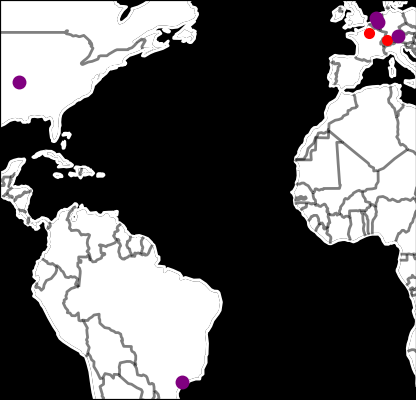

# worldmap

*draws a world map with mix network nodes overlayed on top*

---




## status

Works with Katzenpost v0.0.49 or later.

## Installation / Depedencies


**worldmap** depends on the thinclient which requires you
to run a katzenpost client2 daemon. Build `kpclientd`:


```bash
git clone https://github.com/katzenpost/katzenpost.git
cd katzenpost/client2/cmd/kpclientd
go build
```

Run the client daemon first:

```bash
./kpclientd -c /home/human/client2.toml
```

You will need to supply a copy of the geoip database. You can
download your free copy from https://dev.maxmind.com/geoip/geolite2-free-geolocation-data/


### Commandline Usage

```
Usage: worldmap [OPTIONS]

Options:
  --config TEXT       Path to the thin client TOML configuration file.
                      [required]
  --geolite2-db TEXT  Path to the GeoLite2 City database.  [default:
                      GeoLite2-City.mmdb]
  --dirauth-ips TEXT  File containing the list of directory authority IP
                      addresses, one address per line.
  --output TEXT       Output file name for the generated world map.  [default:
                      world_map.png]
  --help              Show this message and exit.
```


### Example CLI Usage

```bash

worldmap --config ~/code/katzenpost/docker/voting_mixnet/client2/thinclient.toml --geolite2-db /home/human/code/GeoLite2-City_20241025/GeoLite2-City.mmdb --dirauth-ips wtf.list --output world_mixnet_map.png

```

# License

AGPLv3
