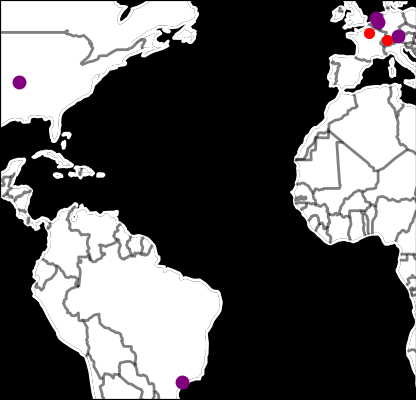

# worldmap

*draws a world map with mix network nodes overlayed on top*

---




## status

works with Katzenpost version v0.0.41 or later

## Installation / Depedencies


**worldmap** depends on the thinclient which requires you
to run a katzenpost client2 daemon. Build `kpclientd`:


```bash
git clone https://github.com/katzenpost/katzenpost.git
cd katzenpost/client2/cmd/kpclientd
go build
```

Run the client daemon first:

```bash
./kpclientd -c /home/human/client2.toml
```

Our thinclient currently requires that your client2 config
has the follow settings:

```toml
ListenNetwork = "unix"
ListenAddress = "@katzenpost"
```

which ensures that the client2 daemon listens on the "@katzenpost"
abstract unix domain socket for thinclient connections.

You will need to supply a copy of the geoip database. You can
download your free copy from https://dev.maxmind.com/geoip/geolite2-free-geolocation-data/


### Commandline Usage

```
Usage: world_map.py [OPTIONS]

Options:
  --geolite2-db TEXT  Path to the GeoLite2 City database.  [default:
                      GeoLite2-City.mmdb]
  --dirauth-ips TEXT  File containing the list of directory authority IP
                      addresses, one address per line.
  --output TEXT       Output file name for the generated world map.  [default:
                      world_map.png]
  --help              Show this message and exit.
```

# License

AGPLv3
